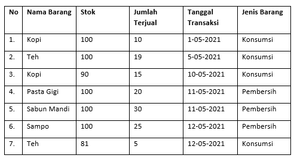

# Technical Test at PT Qtasnim Digital Teknologi

SOAL: Buatlah aplikasi data penjualan dengan memanfaatkan data berikut :
Ketentuan Pengerjaan:

1. Menggunakan Bahasa dan framework yang dikuasai
2. menggunakan database mysql/mssql/Postgre

   

Tugas :

1. Lakukan normalisasi terhadap data diatas dengan menerapkannya di database
2. Buatlah backend & frontend CRUD (Create Read Update Delete) untuk data table hasil dari soal 1
3. Buatlah backend & frontend dengan adanya fitur searching dan bisa mengurutkan data berdasarkan nama barang, tanggal transaksi
4. Buatlah backend & frontend untuk membandingkan jenis barang dengan menampilkan data transaksi terbanyak terjual atau terendah
5. Buatlah filter terhadap soal 4 untuk memilih rentang waktu tertentu

Nilai Plus:

1. Menggunakan interface API agar aplikasi lain dapat mengambil data secara terprogram dan terstruktur
2. Tampilan frontend(UI/UX) menjadi point tambahan jika aplikasi berjalan sesuai bagaimana mestinya
3. Hasil codenya dipublish di repository git (github/gitlab)

---

### System Requirement

1. PHP >= 8.0.0
2. NodeJS >= 18.0.0
3. NPM
4. Database MySQL/MariaDB

### Folder

Jawaban Backend ada di folder `./server`, sedangkan hasil jawaban Frontend ada di folder `./client`

### Running Program

1. pertama jalankan server backend
2. masuk ke folder backend `cd ./server`
3. install dependecies `composer install`
4. buat file environtment `cp .env.example .env`
5. buat key di file environment `php artisan key:generate`, atau bisa memasukan random string secara manual
6. buat database dengan nama `test-pt-qtasnim-digital-teknologi`
7. lalu ubah settingan `DB_USERNAME` dan `DB_PASSWORD` di file environtment `./server/.env`
8. jalankan migration dan seeder agar data awal tidak kosong `php artisan migrate:fresh --seed`
9. jalankan server backend `php artisan serve`
10. server berjalan di `http://localhost:8000`

---

1. setelah server berjalan, saatnya setup client (frontend)
2. masuk ke folder client `cd ./client`
3. install dependecies `npm install`
4. jalankan frontend `npm run dev`
5. buka `http://localhost:5173`
